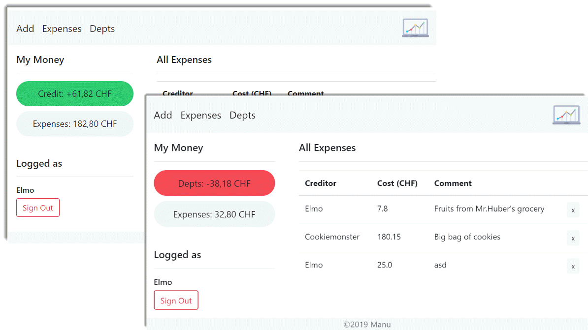
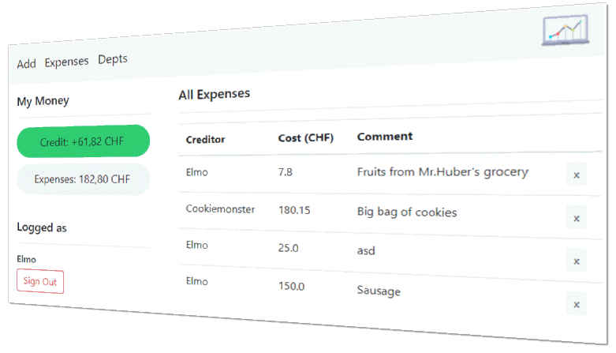
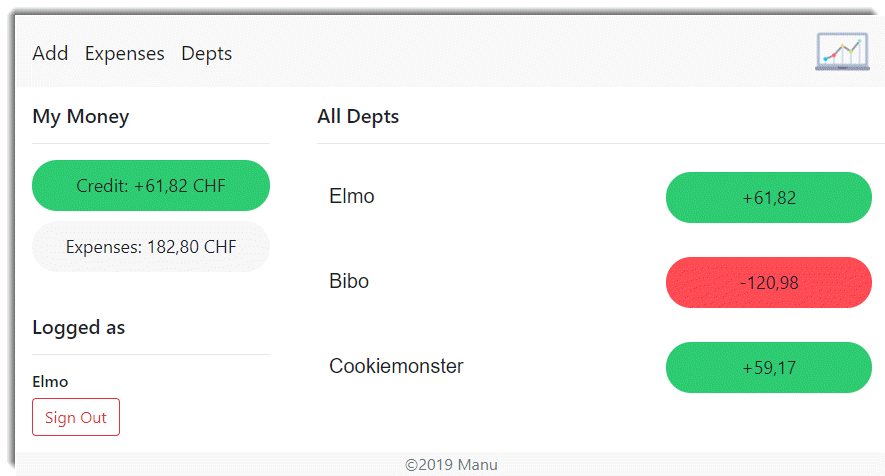
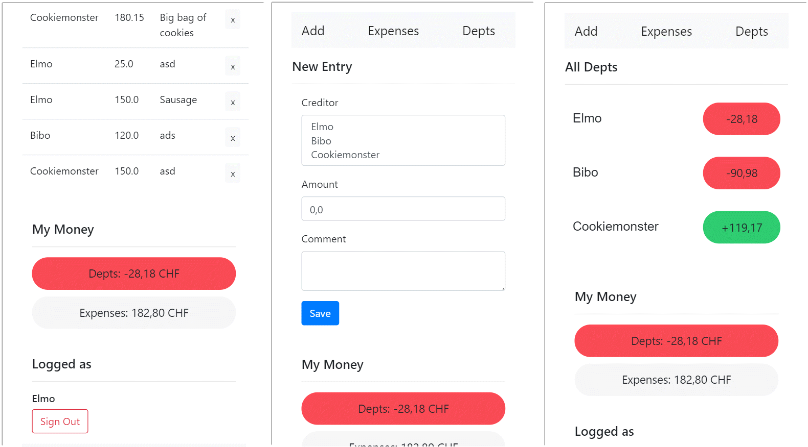

# Introduction Debt Calculator

        

    <h1>Debt Calculator 3000</h1>

<section id="about">
    <h3>About</h3>
    

    
    <h4>A Useful Tool</h4>
    
With the Dept Calculator 3000 you can fairly divide the financial expenses incurred in a household between
        residents. Members can quickly and easily capture their purchases, paid bills or other expenses, and see who
        owes whom how much at once.

</section>

<section id="features">
    <h3>Features</h3>
    

    

        <h4>Your Depts Always Visible</h4>
        
        
Your personal finances are always visible on the left side.  
            If you are in the plus, your money bubble automatically turns green, otherwise it turns red..

        <h4>Get An Overview Of All Expenses</h4>
        
        
See an overview of all issues at any time. Wrong issues can be easily deleted from here.

        <h4>See all debts at a glance</h4>
        
        
Keep an eye on who, by whom, how much debt has.

        <h4>Super Fast Inputs</h4>
        
        
Fast entry via an input mask.

        <h4>Fully Mobile Responsive</h4>
        
        
To record expenses directly during a purchase, the entire application can also be operated on the smart
            phone.

    

</section>

<section id="login">
    <h3>Login Informations</h3>
    
The application is secured by Spring Security.   There are two types of roles: Admin or User. As an Admin you
        can also access
        the database provided by Scaffold UI. 
        Initially, the following three users are available:
    

    <table>
        <thead>
        <tr>
            <th>Username</th>
            <th>Password</th>
            <th>Role</th>
        </tr>
        </thead>
        <tbody>
        <tr>
            <td>Elmo</td>
            <td>123</td>
            <td>Admin</td>
        </tr>
        <tr>
            <td>Bibo</td>
            <td>123</td>
            <td>User</td>
        </tr>
        <tr>
            <td>Cookiemonster</td>
            <td>123</td>
            <td>User</td>
        </tr>

        </tbody>
    </table>

</section>

<footer>
    

        &copy; 2019 Manuel Riedi
    

</footer>

</body>

## Project idea short description: 
Mit dieser Webapplikation sollen finanzielle Ausgaben, welche in einem Haushalts zwischen Bewohnern anfallen, fair verwaltet werden können. 
Die Umsetzung sieht vor, dass die Mitbewohner ihre Einkäufe, bezahlte Rechnungen oder sonstige Ausgaben, welche die Gemeinschaft betreffen mittels einer Eingabemaske erfassen können. Weitere zentrale Bestandteile sollen sein: 
- Eine Tabelle, die alle erfassten Einträge übersichtlich aufliste. 
- Die Information als Zahlen oder Statistik, wer, bei wem, wie viele Schulden hat. 

