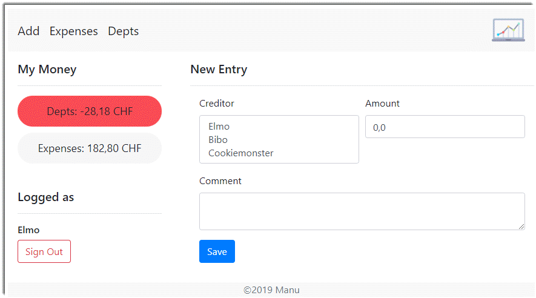

<!DOCTYPE html>
<html lang="en">
<head>
    <title>Introduction Debt Calculator</title>
    <meta charset="utf-8">
    <link rel="stylesheet" type="text/css" href="index.css"/>
    <link href="https://fonts.googleapis.com/css?family=Roboto:500&display=swap" rel="stylesheet">
    <link href="https://fonts.googleapis.com/css?family=Roboto+Slab&display=swap" rel="stylesheet">
</head>

<body>

<header>
    

        
    

    <nav id="main-nav">
        <ul>
            <li><a href="#home">Home</a></li>
            <li><a href="#about">About</a></li>
            <li><a href="#features">Features</a></li>
            <li><a href="#login">Logininfo</a></li>
        </ul>
    </nav>
</header>

<section id="home">
    <h1>Debt Calculator 3000</h1>
</section>

<section id="about">
    <h3>About</h3>
    

    
    <h4>A Useful Tool</h4>
    
With the Dept Calculator 3000 you can fairly divide the financial expenses incurred in a household between
        residents. Members can quickly and easily capture their purchases, paid bills or other expenses, and see who
        owes whom how much at once.

</section>

<section id="features">
    <h3>Features</h3>
    

    

        <h4>Your Depts Always Visible</h4>
        
        
Your personal finances are always visible on the left side.  
            If you are in the plus, your money bubble automatically turns green, otherwise it turns red..

        <h4>Get An Overview Of All Expenses</h4>
        
        
See an overview of all issues at any time. Wrong issues can be easily deleted from here.

        <h4>See all debts at a glance</h4>
        
        
Keep an eye on who, by whom, how much debt has.

        <h4>Super Fast Inputs</h4>
        
        
Fast entry via an input mask.

        <h4>Fully Mobile Responsive</h4>
        
        
To record expenses directly during a purchase, the entire application can also be operated on the smart
            phone.

    

</section>

<section id="login">
    <h3>Login Informations</h3>
    
The application is secured by Spring Security.   There are two types of roles: Admin or User. As an Admin you
        can also access
        the database provided by Scaffold UI. 
        Initially, the following three users are available:
    

    <table>
        <thead>
        <tr>
            <th>Username</th>
            <th>Password</th>
            <th>Role</th>
        </tr>
        </thead>
        <tbody>
        <tr>
            <td>Elmo</td>
            <td>123</td>
            <td>Admin</td>
        </tr>
        <tr>
            <td>Bibo</td>
            <td>123</td>
            <td>User</td>
        </tr>
        <tr>
            <td>Cookiemonster</td>
            <td>123</td>
            <td>User</td>
        </tr>

        </tbody>
    </table>

</section>

<footer>
    

        &copy; 2019 Manuel Riedi
    

</footer>

</body>

# WebEngineering Module, Graded Exercise

## Commit Proposal

Matriculation Number: 17-548-371

Project idea short description: 
Mit dieser Webapplikation sollen finanzielle Ausgaben, welche in einem Haushalts zwischen Bewohnern anfallen, fair verwaltet werden können. 
Die Umsetzung sieht vor, dass die Mitbewohner ihre Einkäufe, bezahlte Rechnungen oder sonstige Ausgaben, welche die Gemeinschaft betreffen mittels einer Eingabemaske erfassen können. Weitere zentrale Bestandteile sollen sein: 
- Eine Tabelle, die alle erfassten Einträge übersichtlich aufliste. 
- Die Information als Zahlen oder Statistik, wer, bei wem, wie viele Schulden hat. 

## Project confirmation

I am looking forward for your implementation! You might start.

## Project delivery <to be filled by student>

How to start the project: (if other than `grailsw run-app`)

How to test the project:  (if other than `grailsw test-app`)

Hand-written, static HTML 
project description:      (if other than `index.html` in project root directory)

External contributions:

Other comments: 

I'm particular proud of:

## Project grading 

[index.html](index.html) looks nice, is valid and makes use of _semantic_ elements.

Application starts and looks nice. I've noticed the default server port change... :smirk:
Things which could be improved:

* A given creditor should NOT be able to make new entry for other creditor than himself.
* As creditor, I should be able to edit/remove my own entries.
* If I do NOT have sufficient rights, I should even see the **delete** button. On view side,
**Grails** is offering some support via taglibs for such task.

#### Features

* Navigation, constraints on domain model(s)
* Spring Security with styled login
* 4 domain models (whose 3 are security related and NOT really new...)

#### Engineering

* 4 unit tests
* A quite impressive commit log

I am giving you 1 point for the use of semantic elements and 2 points for design.

You did a really good job. You've showed a good command of web engineer principles and you 
took full advantage of **Grails** features to materialize your project. Congratulations!

Grade: **6.0**

---
**QUESTION**

You've started a **taglib** `grails-app/taglib/MyMoneyTagLib.groovy`. But it is NOT used, right?

---# WEBEC
